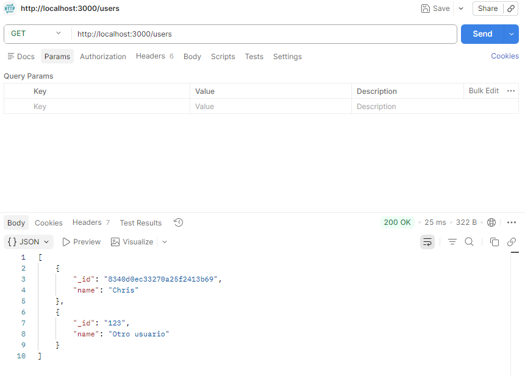
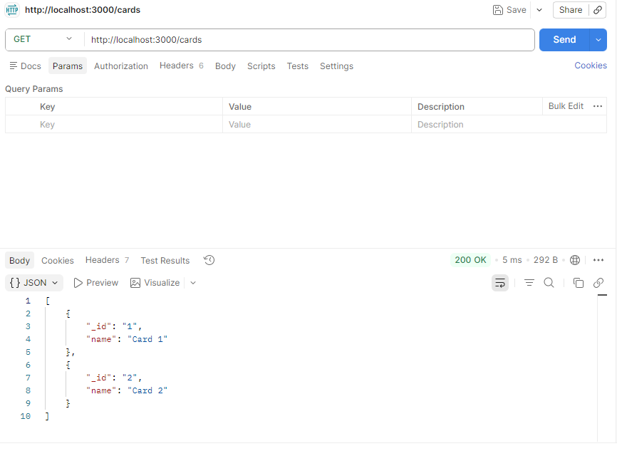

# Around Express

## Descripción

Este proyecto consiste en la creación de un servidor backend utilizando Node.js y Express para el proyecto "Alrededor de los EE. UU.".

## Funcionalidad

El servidor permite obtener información de usuarios y tarjetas mediante rutas API.

## Tecnologías

- Node.js
- Express
- ESLint (Airbnb)
- Nodemon

## Capturas del proyecto

### Obtener usuarios

### cartas

